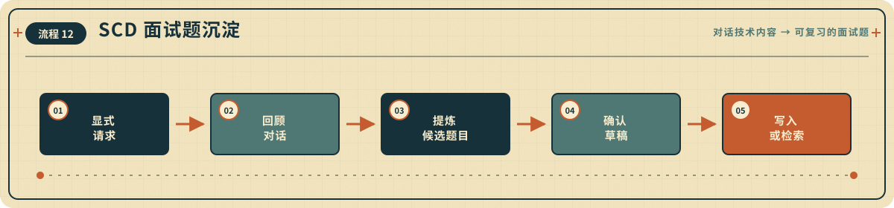

<p align="center">
  
</p>

<h1 align="center">THINLOOP</h1>

<p align="center">
  <strong>需求值得被认真理解，实现不需要被流程接管。</strong>
  <br>
  面向强编码 Agent 的轻量开发闭环：先聊透，再实现，用证据收尾。
</p>

<p align="center">
  <kbd>v0.16.1</kbd>
  &nbsp;
  <kbd>ISSUE-DRIVEN</kbd>
  &nbsp;
  <kbd>EVIDENCE-BACKED</kbd>
  &nbsp;
  <kbd>LESS CEREMONY</kbd>
</p>

<p align="center">
  <a href="#capability-map">三层能力</a> ·
  <a href="#evidence-cases">对照</a> ·
  <a href="#quick-start">开始</a> ·
  <a href="#capabilities">完整目录</a> ·
  <a href="#workflow">闭环</a> ·
  <a href="#skill-flows">技能流程</a> ·
  <a href="#docs">文档</a>
</p>

---

Thinloop 不接管开发过程，只守住容易在长任务里丢失的结果：

> **需求不被误解，体验与架构有据可循，完成声明有真实证据，仓库漂移能被主动发现。**

<a id="capability-map"></a>

## 三层能力 / THREE LAYERS

十二个 Skill 不是十二道固定工序。先按责任看三层，再由任务事实选择最短路径：

| 层级 | Skill | 什么时候进入 |
|---|---|---|
| **核心交付** | [Next](./skills/scd-next/SKILL.md) · [Discovery](./skills/scd-discovery/SKILL.md) · [Project](./skills/scd-project/SKILL.md) · [Execute](./skills/scd-execute/SKILL.md) · [QuickDev](./skills/scd-quickdev/SKILL.md) | 从状态导航、产品澄清和多交付拆解，一直到每个 Issue 的实现、验收与合并。清晰单交付直接进入 QuickDev。 |
| **条件设计与再工程** | [UIUX](./skills/scd-uiux/SKILL.md) · [Architecture](./skills/scd-architecture/SKILL.md) · [Reengineering](./skills/scd-reengineering/SKILL.md) | 只有体验、系统边界或项目级替换的复杂度真实存在时才加入，不是普通任务的必经阶段。 |
| **主动治理与个人能力** | [Maintenance](./skills/scd-maintenance/SKILL.md) · [Knowledge](./skills/scd-knowledge/SKILL.md) · [Evolve](./skills/scd-evolve/SKILL.md) · [Interview](./skills/scd-interview/SKILL.md) | 只在用户明确要求审计、沉淀、演进或提炼面试题时调用，普通开发不会自动触发。 |

<a id="evidence-cases"></a>

## 三个可追溯对照 / BEFORE & AFTER

### 01 · 修一个 Bug

- **Before：** 仓库原有测试是绿色的，仍可能漏掉用户报告的具体输入；只说“测试通过”不能证明行为已经闭合。
- **After：** QuickDev 先把 Bug 绑定到一个中文 Issue，再用直接回归证据、完整 Issue 审计和独立验收约束完成声明。依据：[Issue 交付契约](./skills/scd-quickdev/references/issue-delivery-contract.md)、[证据契约](./skills/scd-quickdev/references/evidence-contract.md)和当前评测的 [`false-completion-audit`](./evals/thinloop/manifest.json) fixture。
- **证据边界：** #74 的当前 smoke 只运行一个 fixture，`native`、`prompt`、`thinloop` 三个条件均为 `PASS`；**没有观察到 Thinloop 的相对增益**。完整数字与限制见[当前真实 smoke](./EVALUATION.md#当前真实-smoke)。

### 02 · 从模糊想法到多 Issue 项目

- **Before：** “让用户导出数据”仍缺格式、数据范围等产品决定；把它直接塞进一个实现任务，会混合产品澄清、项目拓扑和代码交付。
- **After：** Discovery 只收敛尚未决定的产品结果；稳定结果确实包含多个独立交付时，Project 建立 Initiative 与 Delivery Issue DAG；批准后由 Execute 把 READY 节点送入隔离 QuickDev 通道。依据：[Discovery](./skills/scd-discovery/SKILL.md)、[Project](./skills/scd-project/SKILL.md)、[Execute](./skills/scd-execute/SKILL.md)及当前评测中尚待完整运行的 [`underdefined-feature` 与 `multi-issue-project`](./evals/thinloop/manifest.json) 定义。
- **证据边界：** 这是当前仓库的契约路径和已冻结评测定义，不是 #74 单 fixture smoke 已观察到的相对收益。

### 03 · 长任务失败后恢复

- **Before：** 历史受控用例中，基线完成恢复任务后留下过期状态；按要求中途停止时没有留下可恢复状态。
- **After：** 当时的 `scd-dev-loop` 在对应两例中清理了失效状态，并留下包含唯一下一步的恢复记录。当前 QuickDev 把 GitHub Issue 作为权威，只在确有跨会话需要时使用 `.scd/tasks/current.md` 后备；Execute 从实时 Initiative、Issues、PR 和仓库状态重建项目进度。依据：[0.1.0 历史报告](./EVALUATION.md#scd-dev-loop-010-历史报告)、[QuickDev 连续性契约](./skills/scd-quickdev/references/continuity-contract.md)和[Execute](./skills/scd-execute/SKILL.md)。
- **证据边界：** 历史两臂结果证明旧版固定 fixture 的差异，不等于当前十二 Skill、其他模型或真实项目已经获得同样收益。

<a id="quick-start"></a>

## 30 秒开始 / QUICK START

大多数开发任务只需要调用 `scd-quickdev` 并说明目标：

```text
使用 scd-quickdev 修复登录后偶发白屏，并补回归验证。
使用 scd-quickdev 增加 CSV 导出，完成后提 PR 并合并 main。
```

QuickDev 会先判断任务是否足够清楚，而不是要求用户选择流程：

QuickDev 默认不询问你是否要先审核 Issue、实施方案和任务清单，而是直接创建或
更新中文 Issue 并继续自动交付。只有你主动要求先看或先确认时，Agent 才会展示
完整草案并等待明确确认；此后发生实质性变化还要再次确认。Issue 就是持久计划，
不额外生成 `plan.md`。QuickDev 创建或更新的 Issue
标题、正文、实施任务和验证记录统一使用中文；命令、路径和机器状态标识保持原样。
十二个 Thinloop Skill 的说明、提示词、参考契约和模板也统一使用中文。

开发完成后，QuickDev 会重新审计整张 Issue：验收项必须有直接行为证据，实施
任务必须标记为 `DONE`、`SUPERSEDED` 或 `N/A`，交付差异、检查和阻塞也必须闭合。
页面、路由、组件交互或可见样式发生变化时，不论是否走过 UIUX，都必须通过真实
浏览器控件完成关键旅程，并记录页面、状态、视口、视觉 ID 和截图或追踪证据；
浏览器路径不可用时只能 `BLOCKED`，不能用构建或 API 调用代替。

### 八条规范路由

下面的八条路由由
[`config/routing-kernel.json`](./config/routing-kernel.json) 统一生成；修改路由时只改该事实源。

<!-- thinloop-routing-kernel:start source=config/routing-kernel.json -->
1. **Next**：只问状态、阻塞或下一步 → `scd-next`：只读实时 Issue、PR、Initiative DAG 与验收证据，给出唯一下一行动。
2. **QuickDev**：清晰的单交付仓库变更 → `scd-quickdev`：以一个中文 Issue 为边界实现和验证；直接证据与独立验收通过后才合并，高风险动作仍需明确批准。
3. **Discovery**：产品结果仍不清楚，尤其是从 0 到 1 或多个相互依赖的产品决定 → `scd-discovery`。
4. **Project**：已批准的稳定结果包含多个可独立验证交付 → `scd-project`：只建立并校验 Initiative、Delivery Issues 与依赖 DAG，不执行实现。
5. **Execute**：已批准 Initiative 需要开始、继续、恢复或完成 → `scd-execute`：选择当前安全 READY 波次，每个 Issue 进入隔离 QuickDev 通道。
6. **Reengineering**：跨语言、框架、架构、存储或运行时替换，或项目级大幅重构 → `scd-reengineering`：先固定来源、兼容性与切换门，再消费批准的 DAG。
7. **条件设计**：只有真实复杂度需要时才加入设计：重要 Web 体验 → `scd-uiux`；领域、系统或共享接口边界 → `scd-architecture`。
8. **显式治理**：只有用户明确要求时才调用治理与个人能力：`scd-maintenance`、`scd-knowledge`、`scd-evolve`、`scd-interview`；普通开发不得自动触发。
<!-- thinloop-routing-kernel:end -->

新产品的 `.scd/product/prd.md` 保存产品级 why/what、MVP、`FR-*` 需求和成功
指标；Initiative 保存交付拓扑，各 Delivery Issue 保存自身切片和验收。PR
保存实现证据、工程审阅和回滚边界。清晰单功能和 Bug 仍直接使用 Issue，不会
制造 PRD，也不强制创建 worktree。

<a id="capabilities"></a>

## 完整十二 Skill 目录 / FULL CATALOG

<table width="100%">
  <tr>
    <td width="33%" valign="top">
      
      <h3><a href="./skills/scd-discovery/SKILL.md">01 · SCD Discovery</a></h3>
      <p>把模糊想法收敛为批准的交付契约；从 0 到 1 时形成轻量 PRD。</p>
      <p><strong>适合：</strong>新产品、复杂功能、多个产品决定相互依赖。</p>
    </td>
    <td width="33%" valign="top">
      
      <h3><a href="./skills/scd-uiux/SKILL.md">02 · SCD UIUX</a></h3>
      <p>把稳定的产品行为设计成 UX 契约、项目内 UI 图和可练习原型。</p>
      <p><strong>适合：</strong>重要页面、复杂用户流、页面状态、响应式交互与视觉设计。</p>
    </td>
    <td width="33%" valign="top">
      
      <h3><a href="./skills/scd-architecture/SKILL.md">03 · SCD Architecture</a></h3>
      <p>把产品行为翻译为领域、系统边界和共享机器契约。</p>
      <p><strong>适合：</strong>新系统、公共接口和高影响技术边界。</p>
    </td>
  </tr>
  <tr>
    <td width="33%" valign="top">
      
      <h3><a href="./skills/scd-project/SKILL.md">04 · SCD Project</a></h3>
      <p>把多交付项目拆成 Initiative、独立 Issue 和可验证依赖图。</p>
      <p><strong>适合：</strong>多个交付切片、跨 Issue 前置依赖和集成闸门。</p>
    </td>
    <td width="33%" valign="top">
      
      <h3><a href="./skills/scd-execute/SKILL.md">05 · SCD Execute</a></h3>
      <p>消费已批准的 Initiative DAG，按安全 READY 波次并行交付。</p>
      <p><strong>适合：</strong>开始、继续或恢复普通多交付项目。</p>
    </td>
    <td width="33%" valign="top">
      
      <h3><a href="./skills/scd-quickdev/SKILL.md">06 · SCD QuickDev</a></h3>
      <p>从 Issue 开始完成诊断、开发、验证、PR 和可自动合并的交付。</p>
      <p><strong>适合：</strong>Bug、清晰功能、已批准 Issue 和跨会话实现。</p>
    </td>
  </tr>
  <tr>
    <td width="33%" valign="top">
      
      <h3><a href="./skills/scd-knowledge/SKILL.md">07 · SCD Knowledge</a></h3>
      <p>把已证实的开发经验沉淀为短知识，并在需要时找回。</p>
      <p><strong>适合：</strong>主动沉淀、查找或维护开发经验。</p>
    </td>
    <td width="33%" valign="top">
      
      <h3><a href="./skills/scd-maintenance/SKILL.md">08 · SCD Maintenance</a></h3>
      <p>主动审计并小批修复技术债和代码—文档漂移。</p>
      <p><strong>适合：</strong>主动扫描、清理、对齐或维护现有仓库。</p>
    </td>
    <td width="33%" valign="top">
      
      <h3><a href="./skills/scd-evolve/SKILL.md">09 · SCD Evolve</a></h3>
      <p>从一次开发互动中诊断 Skill 问题，经用户批准后做可回滚试验。</p>
      <p><strong>适合：</strong>主动复盘并优化本次真正使用过的 Thinloop Skill。</p>
    </td>
  </tr>
  <tr>
    <td width="33%" valign="top">
      
      <h3><a href="./skills/scd-reengineering/SKILL.md">10 · SCD Reengineering</a></h3>
      <p>用行为基线和兼容边界治理项目级重构、跨语言或跨架构重新实现。</p>
      <p><strong>适合：</strong>开源项目重写、技术栈迁移、渐进替换和大型重构。</p>
    </td>
    <td width="33%" valign="top">
      
      <h3><a href="./skills/scd-next/SKILL.md">11 · SCD Next</a></h3>
      <p>只读扫描实时 Issue、PR、Initiative DAG 和验收状态，给出唯一下一步。</p>
      <p><strong>适合：</strong>查看当前进度、未完成工作、阻塞原因或恢复入口。</p>
    </td>
    <td width="33%" valign="top">
      
      <h3><a href="./skills/scd-interview/SKILL.md">12 · SCD Interview</a></h3>
      <p>回顾对话，提炼带参考答案的面试题，确认后存到个人题库。</p>
      <p><strong>适合：</strong>备考复习、面试准备、把开发讨论沉淀成题目。</p>
    </td>
  </tr>
</table>

> 能力卡直达各 Skill 的权威说明；更细的契约和模板沿其 `Resources` 按需读取，不在 README 重复维护。

<a id="workflow"></a>

## 工作闭环 / WORKFLOW

<p align="center">
  
</p>

清晰任务直接开发；不清晰的需求先讨论；多交付项目才增加 Project 拆解。
Execute 消费普通已批准 Initiative 的 READY 波次；Reengineering 在此基础上
增加源码、兼容性和集成门禁。清晰单交付不制造本地 Spec；新产品只保留一个
批准的轻量 PRD。Next 在用户不知道如何继续时只读重建当前进度并把工作交给
正确的责任 Skill。默认不强制 TDD、角色系统或固定阶段；Project 自身不执行
工程 loop，QuickDev 每个 lane 只固定使用一个独立验收 Agent，并在验收前闭合
Issue 的验收、实施和交付三本账；页面差异还必须通过真实浏览器门。完整的
路由、状态与契约说明见[工作流与项目状态](./docs/workflow-and-state.md)。

<a id="skill-flows"></a>

## 十二个技能如何工作 / SKILL FLOWS

<p></p>
<p></p>
<p></p>
<p></p>
<p></p>
<p></p>
<p></p>
<p></p>
<p></p>
<p></p>
<p></p>
<p></p>

每张图只保留该 Skill 的五个关键节点；完整触发条件、分支和安全边界仍以对应
`SKILL.md` 为准。

<a id="docs"></a>

## 文档索引 / DOCS

| 文档 | 内容 |
|---|---|
| [工作流与项目状态](./docs/workflow-and-state.md) | 路由原则、Issue/PR 边界、最小状态与契约入口 |
| [安装与更新指南](./docs/installation.md) | 九类 Agent（含 DeepSeek Harness、Pi、CodeWhale 与 Reasonix）的安装、升级、调用与 Evolve 源码配置 |
| [验证指南](./docs/verification.md) | 仓库校验命令、各 Agent 的运行时证据与已知边界 |
| [评测说明](./EVALUATION.md) | 评测方法、历史证据与限制 |

---

<p align="center">
  <strong>DEEPER UNDERSTANDING · LESS CEREMONY · STRONGER EVIDENCE</strong>
  <br>
  MIT License · 2026 mindcarver
</p>
