<p align="center">
  
</p>

<h1 align="center">THINLOOP</h1>

<p align="center">
  <strong>需求值得被认真理解，实现不需要被流程接管。</strong>
  <br>
  面向强编码 Agent 的轻量开发闭环：先聊透，再实现，用证据收尾。
</p>

<p align="center">
  <kbd>v0.13.1</kbd>
  &nbsp;
  <kbd>ISSUE-DRIVEN</kbd>
  &nbsp;
  <kbd>EVIDENCE-BACKED</kbd>
  &nbsp;
  <kbd>LESS CEREMONY</kbd>
</p>

<p align="center">
  <a href="#quick-start">开始</a> ·
  <a href="#capabilities">能力</a> ·
  <a href="#workflow">闭环</a> ·
  <a href="#skill-flows">技能流程</a> ·
  <a href="#docs">文档</a>
</p>

---

Thinloop 不接管开发过程，只守住容易在长任务里丢失的结果：

> **需求不被误解，体验与架构有据可循，完成声明有真实证据，仓库漂移能被主动发现。**

<a id="quick-start"></a>

## 30 秒开始 / QUICK START

大多数开发任务只需要调用 `scd-quickdev` 并说明目标：

```text
使用 scd-quickdev 修复登录后偶发白屏，并补回归验证。
使用 scd-quickdev 增加 CSV 导出，完成后提 PR 并合并 main。
```

QuickDev 会先判断任务是否足够清楚，而不是要求用户选择流程：

| 当前情况 | 默认路径 |
|---|---|
| Bug 或清晰、局部的新功能 | 建立或确认 Issue，直接诊断、实现和验证 |
| 从 0 到 1 的新产品，或多个产品决定仍未明确 | 调用 Discovery 逐项澄清；新产品批准后形成轻量 PRD |
| 已批准项目包含多个可独立验收的交付 | 调用 Project 从 PRD/产品契约拆成 Initiative、Delivery Issues 和依赖图 |
| 已批准 Initiative 需要开始、继续或恢复交付 | 调用 Execute 自动选择当前安全 READY 波次，每个 Issue 进入独立 QuickDev lane |
| 不清楚当前做到哪、还有什么没做或下一步该干嘛 | 调用 Next 只读检查实时 Issue、PR、Initiative DAG 和验收状态，并给出唯一建议下一步 |
| 对现有项目做大型重构或跨语言、跨架构重新实现 | 调用 Reengineering 固定上游与兼容边界，再执行批准的 Project 任务图 |
| UI 或系统边界会显著影响实现 | 按需组合 UIUX 或 Architecture |
| 工程验证通过 | Agent 自审并提交任务内变更 |
| 工程验证完成 | 一个独立 Agent 优先通过 Open Code Review 审查 diff，通过后执行真实环境验收；只有 `REVIEW_PASS` 和验收 `PASS` 才能交付 |
| 生产部署、认证支付、破坏性数据等高风险工作 | 在高风险动作前停下并请求明确批准 |

新产品的 `.scd/product/prd.md` 保存产品级 why/what、MVP、`FR-*` 需求和成功
指标；Initiative 保存交付拓扑，各 Delivery Issue 保存自身切片和验收。PR
保存实现证据、工程审阅和回滚边界。清晰单功能和 Bug 仍直接使用 Issue，不会
制造 PRD，也不强制创建 worktree。

<a id="capabilities"></a>

## 十一块能力 / CAPABILITIES

<table width="100%">
  <tr>
    <td width="33%" valign="top">
      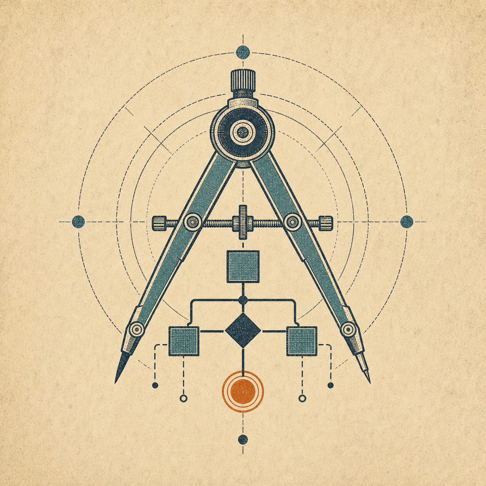
      <h3><a href="./skills/scd-discovery/SKILL.md">01 · SCD Discovery</a></h3>
      <p>把模糊想法收敛为批准的交付契约；从 0 到 1 时形成轻量 PRD。</p>
      <p><strong>适合：</strong>新产品、复杂功能、多个产品决定相互依赖。</p>
    </td>
    <td width="33%" valign="top">
      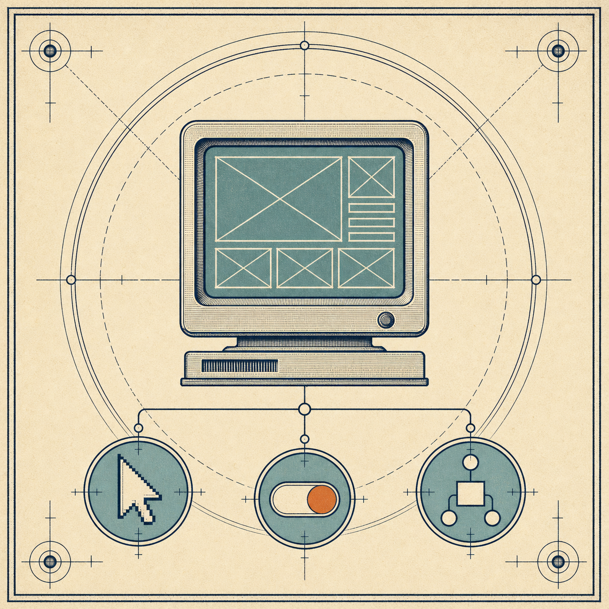
      <h3><a href="./skills/scd-uiux/SKILL.md">02 · SCD UIUX</a></h3>
      <p>把稳定的产品行为设计成可审阅、可实现的 Web 体验。</p>
      <p><strong>适合：</strong>复杂用户流、页面状态、交互与视觉设计。</p>
    </td>
    <td width="33%" valign="top">
      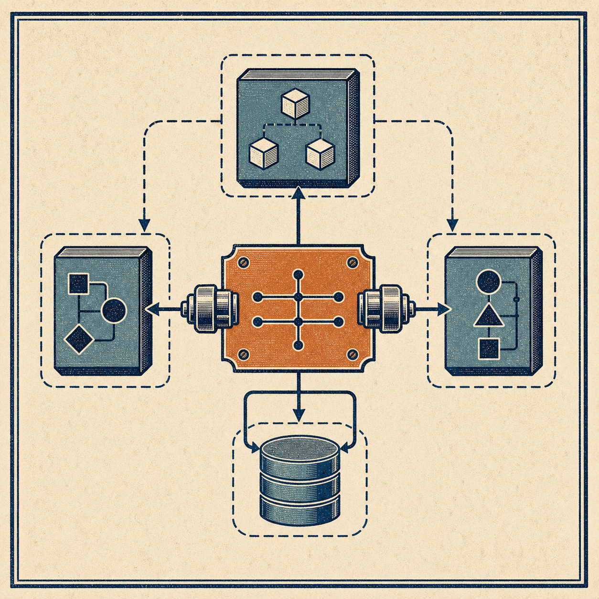
      <h3><a href="./skills/scd-architecture/SKILL.md">03 · SCD Architecture</a></h3>
      <p>把产品行为翻译为领域、系统边界和共享机器契约。</p>
      <p><strong>适合：</strong>新系统、公共接口和高影响技术边界。</p>
    </td>
  </tr>
  <tr>
    <td width="33%" valign="top">
      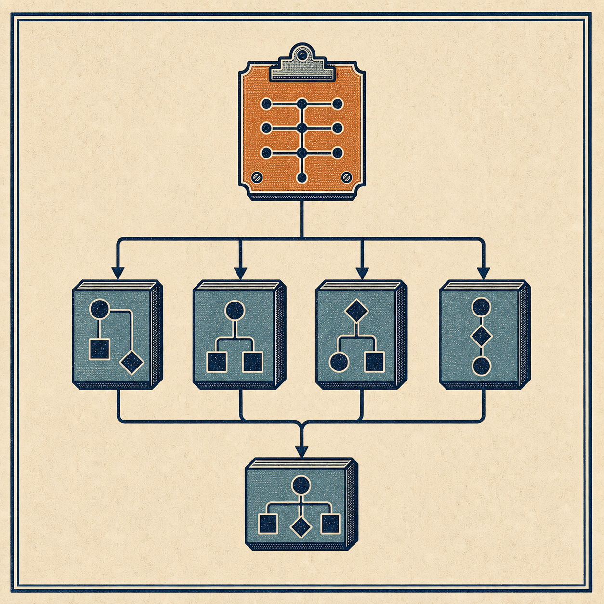
      <h3><a href="./skills/scd-project/SKILL.md">04 · SCD Project</a></h3>
      <p>把多交付项目拆成 Initiative、独立 Issue 和可验证依赖图。</p>
      <p><strong>适合：</strong>多个交付切片、跨 Issue 前置依赖和集成闸门。</p>
    </td>
    <td width="33%" valign="top">
      
      <h3><a href="./skills/scd-execute/SKILL.md">05 · SCD Execute</a></h3>
      <p>消费已批准的 Initiative DAG，按安全 READY 波次并行交付。</p>
      <p><strong>适合：</strong>开始、继续或恢复普通多交付项目。</p>
    </td>
    <td width="33%" valign="top">
      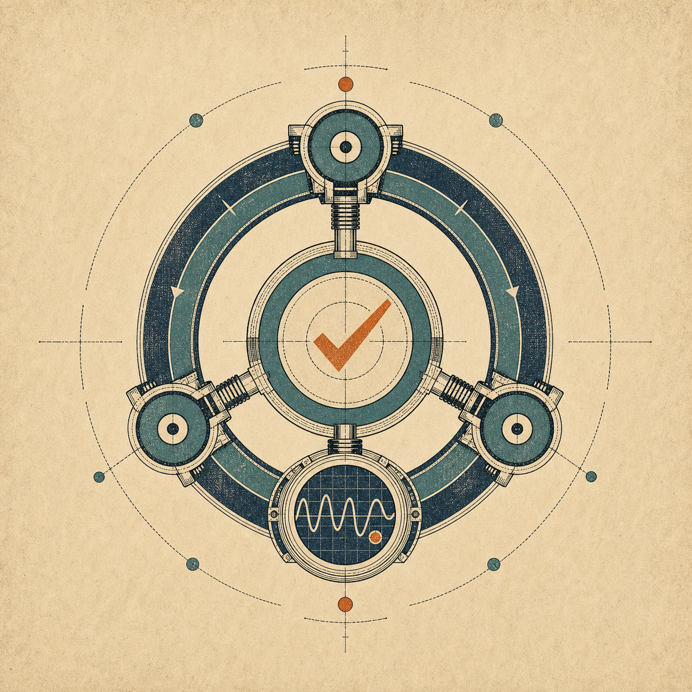
      <h3><a href="./skills/scd-quickdev/SKILL.md">06 · SCD QuickDev</a></h3>
      <p>从 Issue 开始完成诊断、开发、验证、PR 和可自动合并的交付。</p>
      <p><strong>适合：</strong>Bug、清晰功能、已批准 Issue 和跨会话实现。</p>
    </td>
  </tr>
  <tr>
    <td width="33%" valign="top">
      
      <h3><a href="./skills/scd-knowledge/SKILL.md">07 · SCD Knowledge</a></h3>
      <p>把已证实的开发经验沉淀为短知识，并在需要时找回。</p>
      <p><strong>适合：</strong>主动沉淀、查找或维护开发经验。</p>
    </td>
    <td width="33%" valign="top">
      
      <h3><a href="./skills/scd-maintenance/SKILL.md">08 · SCD Maintenance</a></h3>
      <p>主动审计并小批修复技术债和代码—文档漂移。</p>
      <p><strong>适合：</strong>主动扫描、清理、对齐或维护现有仓库。</p>
    </td>
    <td width="33%" valign="top">
      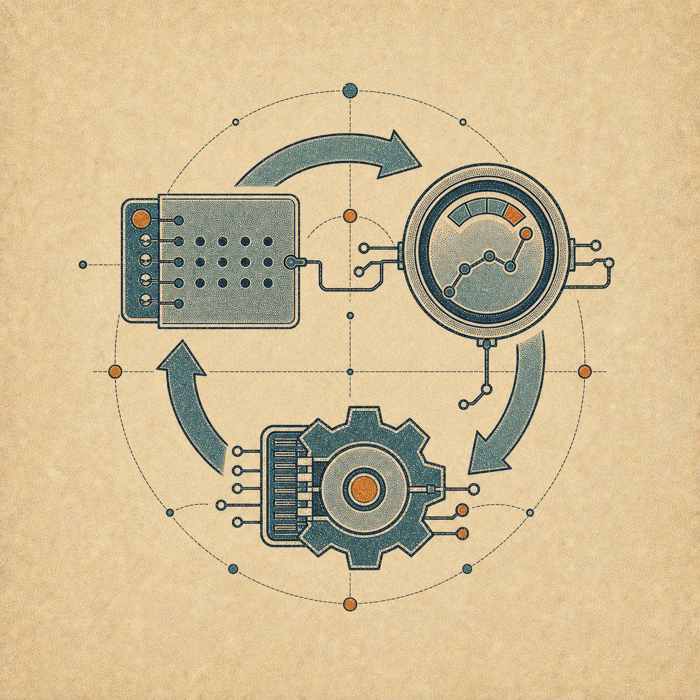
      <h3><a href="./skills/scd-evolve/SKILL.md">09 · SCD Evolve</a></h3>
      <p>从一次开发互动中诊断 Skill 问题，经用户批准后做可回滚试验。</p>
      <p><strong>适合：</strong>主动复盘并优化本次真正使用过的 Thinloop Skill。</p>
    </td>
  </tr>
  <tr>
    <td width="33%" valign="top">
      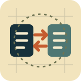
      <h3><a href="./skills/scd-reengineering/SKILL.md">10 · SCD Reengineering</a></h3>
      <p>用行为基线和兼容边界治理项目级重构、跨语言或跨架构重新实现。</p>
      <p><strong>适合：</strong>开源项目重写、技术栈迁移、渐进替换和大型重构。</p>
    </td>
    <td width="33%" valign="top">
      
      <h3><a href="./skills/scd-next/SKILL.md">11 · SCD Next</a></h3>
      <p>只读扫描实时 Issue、PR、Initiative DAG 和验收状态，给出唯一下一步。</p>
      <p><strong>适合：</strong>查看当前进度、未完成工作、阻塞原因或恢复入口。</p>
    </td>
  </tr>
</table>

> 能力卡直达各 Skill 的权威说明；更细的契约和模板沿其 `Resources` 按需读取，不在 README 重复维护。

<a id="workflow"></a>

## 工作闭环 / WORKFLOW

<p align="center">
  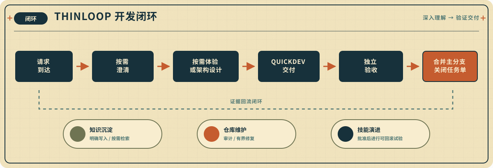
</p>

清晰任务直接开发；不清晰的需求先讨论；多交付项目才增加 Project 拆解。
Execute 消费普通已批准 Initiative 的 READY 波次；Reengineering 在此基础上
增加源码、兼容性和集成门禁。清晰单交付不制造本地 Spec；新产品只保留一个
批准的轻量 PRD。Next 在用户不知道如何继续时只读重建当前进度并把工作交给
正确的责任 Skill。默认不强制 TDD、角色系统或固定阶段；Project 自身不执行
工程 loop，QuickDev 每个 lane 只固定使用一个独立审查与验收 Agent。完整的
路由、状态与契约说明见[工作流与项目状态](./docs/workflow-and-state.md)。

<a id="skill-flows"></a>

## 十一个技能如何工作 / SKILL FLOWS

<p></p>
<p>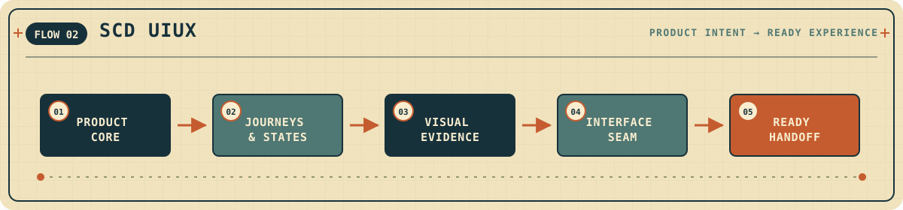</p>
<p></p>
<p>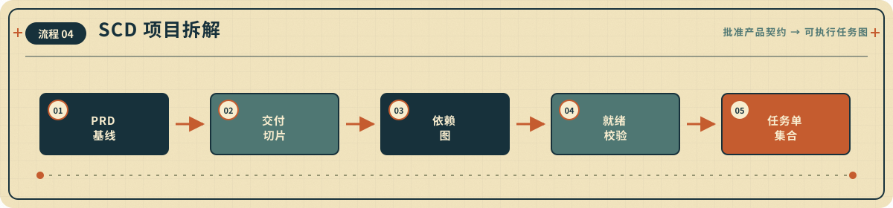</p>
<p>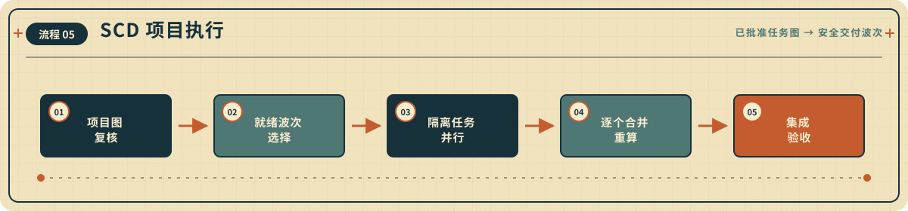</p>
<p></p>
<p>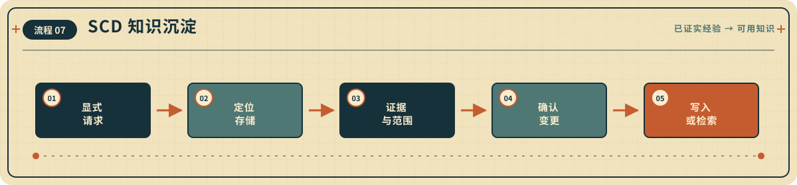</p>
<p></p>
<p></p>
<p>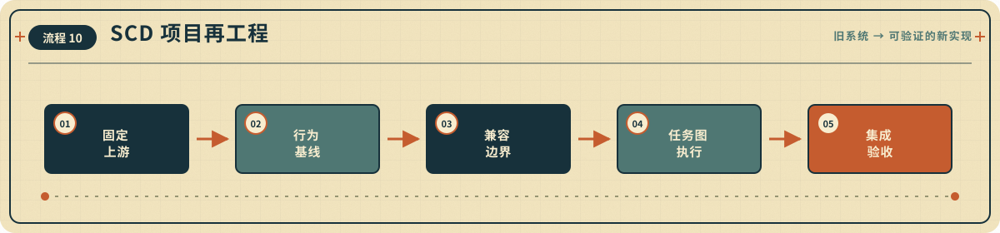</p>
<p>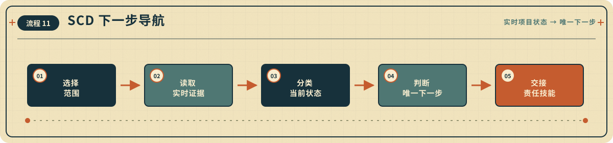</p>

每张图只保留该 Skill 的五个关键节点；完整触发条件、分支和安全边界仍以对应
`SKILL.md` 为准。

<a id="docs"></a>

## 文档索引 / DOCS

| 文档 | 内容 |
|---|---|
| [工作流与项目状态](./docs/workflow-and-state.md) | 路由原则、Issue/PR 边界、最小状态与契约入口 |
| [安装与更新指南](./docs/installation.md) | 八类 Agent（含 Pi、CodeWhale 与 Reasonix）的安装、升级、调用与 Evolve 源码配置 |
| [验证指南](./docs/verification.md) | 仓库校验命令、各 Agent 的运行时证据与已知边界 |
| [评测说明](./EVALUATION.md) | 评测方法、历史证据与限制 |

---

<p align="center">
  <strong>DEEPER UNDERSTANDING · LESS CEREMONY · STRONGER EVIDENCE</strong>
  <br>
  MIT License · 2026 mindcarver
</p>
